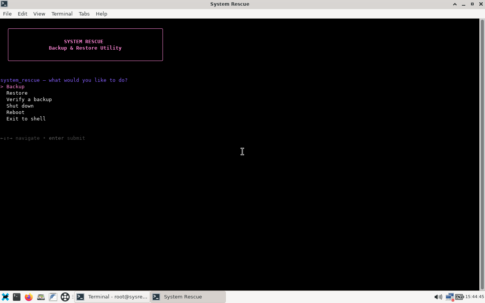
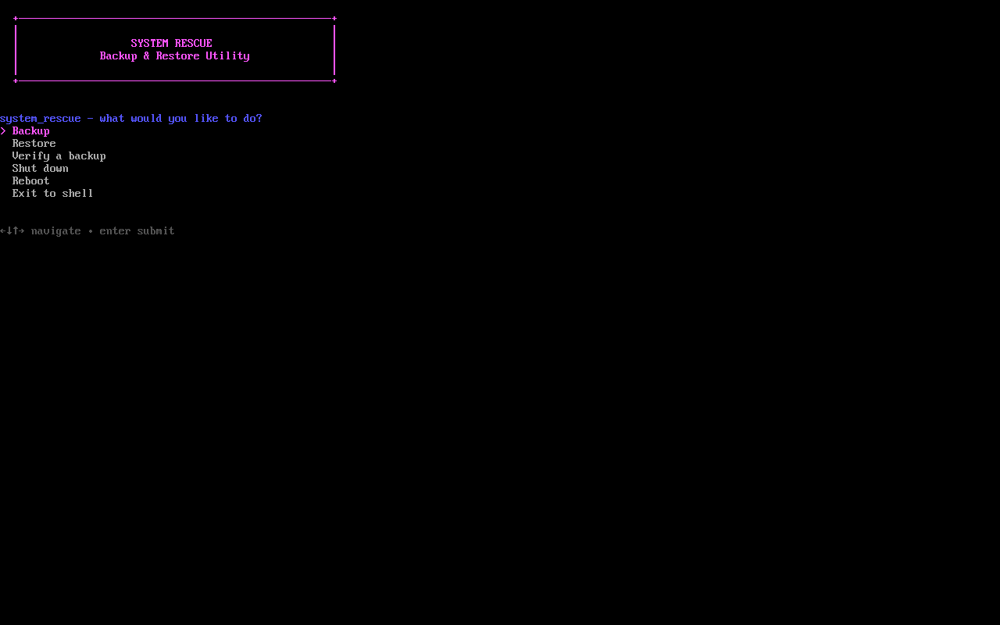
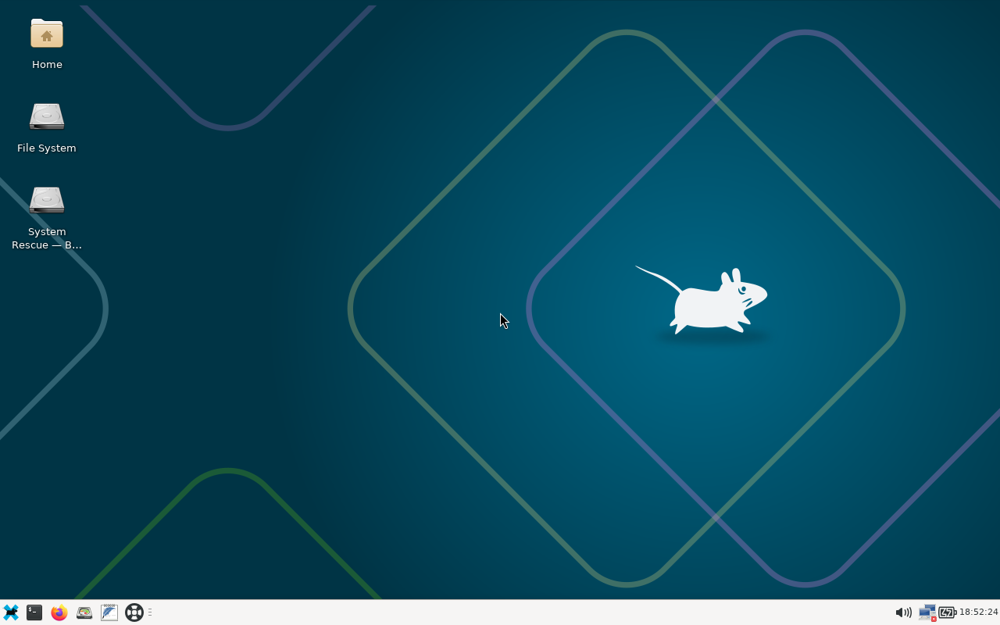

# System Rescue

A personal disk backup and recovery application built on top of
[SystemRescue](https://www.system-rescue.org/): a bootable USB that backs up,
verifies, and restores whole disks (GPT/MBR, EFI, swap, and any filesystem
partclone supports, with a raw-copy fallback for LUKS/LVM/unformatted
partitions) through a small terminal UI, with an optional NVIDIA driver overlay for
workstations whose GPU needs it just to get a usable rescue desktop.

It started life as a customized rescue USB whose own source was lost — the
application in `bin/`/`lib/`/`vendor/` here was reconstructed from the built
overlay found on that USB, then reviewed, fixed, and covered with a
regression suite before any of it was trusted again. `docs/` keeps the full
paper trail: what was found broken, what was fixed, and exactly what has (and
hasn't) been verified on real hardware.

## What it looks like

| Backup / restore menu | Text-console fallback (tty2) |
| --- | --- |
|  |  |

The menu runs over the rescue environment's normal graphical desktop
() or, if the display never
comes up, from a plain text menu on the second virtual console — the same
application either way.

## Why NVIDIA drivers are bundled

The base SystemRescue image only ships the open-source Nouveau driver, which
doesn't reliably drive very recent NVIDIA GPUs (this build targets an RTX
5080). That's a real problem specifically *in a rescue environment*: if the
driver can't bring up a usable display, you lose the graphical desktop and
sometimes the keyboard/mouse exactly when you need them most — mid-recovery,
with no other OS available to fall back to.

The fix is a separate, early-loaded overlay (`sysresccd/nvidia.srm`) that adds
NVIDIA's open kernel modules, matching firmware, and the userspace/EGL stack
needed for an accelerated desktop — without touching the base squashfs,
kernel, or the application itself. Normal boot entries blacklist Nouveau in
favor of the NVIDIA modules; a separate "basic display" (`nomodeset`) entry
blacklists NVIDIA too, in case the NVIDIA stack itself is the thing
misbehaving. See [`docs/nvidia-image.md`](docs/nvidia-image.md) for the exact
package set, build process, and what has and hasn't been physically tested.
The NVIDIA packages themselves are never committed to this repo — see
[`THIRD_PARTY_NOTICES.md`](THIRD_PARTY_NOTICES.md).

## Project layout

- `bin/`, `lib/`, `vendor/` — the application. `vendor/gum` is a bundled
  prebuilt binary (Charm's `gum`), not built here.
- `packaging/` — build/verification tooling, the pinned SystemRescue
  customizer, launch YAML and desktop overlay.
- `docs/` — review findings, build checkpoints, and test/hardware evidence.
- `tests/` — regression tests against fixtures and simulated devices, plus
  QEMU round-trip and firmware-boot harnesses. No real block devices are
  touched.
- `baseline/`, `dist/` — build inputs and output ISOs. Git-ignored; see
  [`docs/build-inputs.md`](docs/build-inputs.md). `baseline/` now holds only
  `last-known-good.iso`, a previously built candidate used as the base image;
  the pristine capture of the original USB is no longer present.

## Status

The latest build is candidate 5. No final release has been produced yet, and
ISOs are not distributed from this repo.

Regression tests, VM round-trips (GPT/Btrfs and DOS/ext4, backup → verify →
restore, with corruption/interruption handling), and a two-VM rehearsal of an
installed OS booting after restore all pass. Real hardware has also been
exercised directly:

- **2026-09-10** — an in-place backup → restore → reboot of a production
  Btrfs NVMe, with logs kept. Source and target were the same disk.
- **2026-09-14** — a backup → restore against an isolated spare disk, plus
  the first physical RTX 5080 boot under the NVIDIA-enabled entry. This is a
  live console observation only; no logs were saved, so the checklist's
  spare-disk item is treated as functionally satisfied, not formally closed.
- **2026-09-19** — an in-place backup → restore → reboot of an ext4 Linux Mint
  NVMe. The image checksums were verified before the restore, and used bytes
  and inode counts after it; the restored partition and filesystem UUIDs match
  the manifest. The successful boot is a user report, not a logged check.

Still not established: a fully documented isolated-spare rehearsal,
duplicate-UUID isolation on real hardware, file-content comparison after a
hardware restore, BIOS bootstrap recovery, 4Kn drives, and every Btrfs feature
combination. Full details, dates, and exactly what each checkpoint does and
doesn't establish are in [`docs/build-checkpoint.md`](docs/build-checkpoint.md).

## Non-negotiable media boundary

The original SystemRescue USB this application was recovered from is never
written to — no formatting, flashing, repartitioning, or repair. Development
operates exclusively on project copies. Flashing a build always targets a
separately identified, freshly verified USB.

## Intended workflow

1. Preserve and verify the source media; record the imported baseline.
2. Fix confirmed correctness problems, backed by file-only regression tests.
3. Reconstruct the build inputs and build an ISO containing the revised application.
4. Test UEFI boot and Backup/Verify/Restore in a VM, including Btrfs
   subvolumes, EFI, corruption, and failure handling.
5. Rehearse recovery on an explicitly designated spare disk, isolating
   duplicate filesystem UUIDs before booting the restored copy.
6. Produce a versioned `.iso`, checksum, and release notes. Verify the built
   payload against the reviewed source.
7. Store the release offline and flash a new USB. Read back and verify the
   flashed image. Retain the original USB unchanged.

Steps 1–4 are done. Step 5 is partly done (see Status). Steps 6–7 wait on a
final release, although development candidates have been flashed to
separately identified USB drives for hardware testing.

`bash bin/build-iso.sh <new-candidate-name.iso>` builds and verifies a
candidate in `dist/`. It refuses to overwrite an existing filename. With no
pristine baseline it builds on `baseline/last-known-good.iso`; pass
`--base-iso=PATH` to use a different base image. See
[`docs/build-inputs.md`](docs/build-inputs.md) for what a build needs beyond
this repo (a base ISO, plus `xorriso`, `squashfs-tools`, `rsync`, `zstd`).

## Checks

```sh
python3 -m unittest discover -s tests -v
```

Runs all regression tests without touching real devices (25 currently pass).
Needs `bash`, `jq`, and `zstd`. The QEMU harnesses (`tests/run_vm.py`,
`tests/two_vm_recovery.py`) can't currently run: they need a kernel/initramfs
and a candidate-2 ISO that are no longer present (see
[`docs/recovery-testing.md`](docs/recovery-testing.md)).

```sh
python3 tests/verify_preservation.py
```

Verifies the preserved capture of the original USB against the checksums in
[`docs/preservation.json`](docs/preservation.json). It needs
`baseline/preservation.json`, the capture archive and `zstd`. That archive is
no longer present (see [`docs/build-inputs.md`](docs/build-inputs.md)), so this
check can't run today. It never accesses a USB.

Passing these tests is not itself a release readiness claim — see
[`docs/recovery-testing.md`](docs/recovery-testing.md) for what VM checks do
and don't establish, and [`docs/build-checkpoint.md`](docs/build-checkpoint.md)
for what's actually been verified on physical hardware so far.

## License

GPL-3.0-or-later — see [`LICENSE`](LICENSE). This project bundles/builds
against a few third-party components under their own licenses; see
[`THIRD_PARTY_NOTICES.md`](THIRD_PARTY_NOTICES.md).
